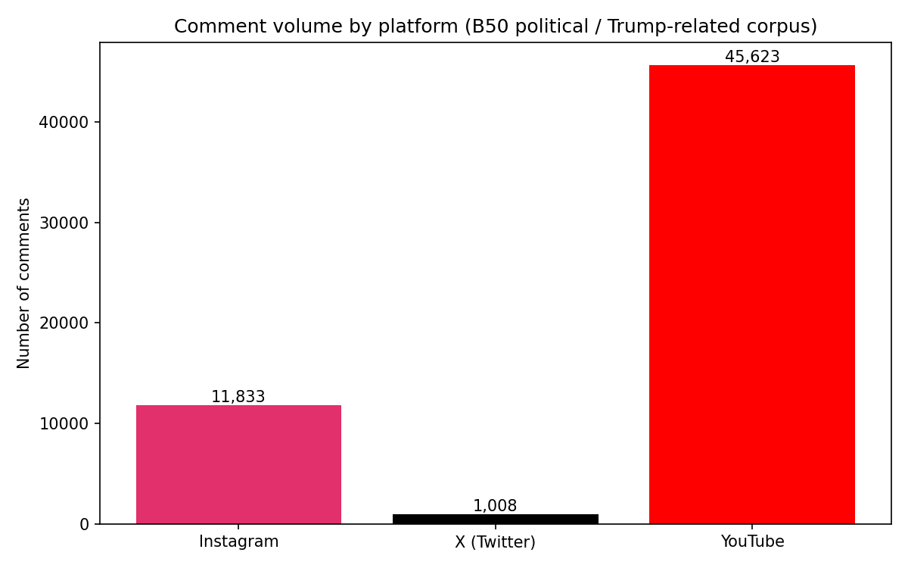

# Project 3 — Research Plan — **RWB**

**Group name:** **RWB**  
**Course:** KIN 7518 — Social Issues in Sport  
**Project theme:** Conflict, Morality, and Polarization  
**Dataset:** **B50** — cross-platform social comments (stored **locally**; see README). Files: `B50_INS_COMMENT.xlsx`, `B50_X_COMMENT.xlsx`, `B50_YT_COMMENT.xlsx`  
**Due:** Friday, April 10, 2026 — follow class workflow (branch → PR → review → merge) and instructor submission instructions  

---

## 1. Research questions and significance

### RQ 1
**The question**  
**(a)** In the **B50** cross-platform social comment corpus (**Instagram**, **X**, **YouTube**)—collected around **sport–politics crossover** media where **Trump-related** political talk is prevalent—how do **moralized discourse** (comments that cast figures or groups as **virtuous vs. corrupt**, **deserving vs. undeserving**, **dangerous vs. harmless**, or that invoke **duty**, **betrayal**, or **care/harm**) and **polarization cues** (clear **pro-Trump vs. anti-Trump** positioning, **partisan blame**, or **us-vs-them** framing) **differ across platforms**? **(b)** **Within each platform**, how are those categories **correlated** with **visible engagement** (e.g., **likes**; on **X**, also **retweets** and **replies**)? We treat engagement as a **descriptive correlate**, not proof that a comment type *caused* more reactions.

**The context**  
B50 comments cluster around **hybrid sport–politics media**: public figures and **golf/sports crossover content** that draws **audience talk about Donald Trump**, elections, and related controversies. That setting is a strong fit for the course theme **Conflict, Morality, and Polarization** because audiences often **moralize** politics (who is a “thief,” who “tried to murder,” who deserves veterans’ charity) while **sorting** into opposing camps. We draw on **political communication** (framing and agenda-setting), work on **affective polarization** (identity-laden support and opposition), and **moral foundations** thinking (harm, fairness, loyalty, authority) as lenses for **why** language takes the shape it does—not to judge voters, but to **describe comment-level patterns**. A **cross-platform** design fits because **Instagram**, **X**, and **YouTube** differ in **length norms**, **threading**, and **algorithmic visibility**, which may shape how **conflict** and **morality** are expressed.

**Why it matters**  
**Citizens**, **journalists**, and **platforms** need clearer pictures of how **moral outrage** and **polarized cues** show up where **sport and politics** overlap. **Researchers and instructors** can use findings for **media literacy** (how hybrid content invites political talk) and for discussing **civil discourse**. **Stakeholders** in sport and politics care whether public comment spaces **amplify hostility** or **mostly cheerlead**—our corpus supports **descriptive** answers for this scrape, not forecasts of elections.

---

### RQ 2 (optional)
**The question**  
On **X only** (the smallest B50 subsample), are **author verification** (`blue_verified`) or **follower count** (e.g., binned tiers) **correlated** with **(a)** **engagement** (likes, retweets, replies) and/or **(b)** a **higher share** of comments we code as **moralized** or **polarized** (per §3)?

**The context**  
The **X** file includes **rich author metadata** that the other two exports lack. That lets us ask whether **status and reach** align with **how** conflict and morality are performed in this smaller **X** slice—relevant to debates about **who dominates** visible political talk.

**Why it matters**  
If **verified** or **large-follower** accounts systematically differ from others, readers should not treat **“typical X comments”** in B50 as **representative** of all users; it affects how we **interpret** polarization patterns on that platform.

---

## 2. Dataset selection and justification

**Dataset**  
B50 (Instagram, X, and YouTube comment exports). Data files are **not** in this repository; each group member keeps copies **locally** or on an agreed **shared drive**.

**Justification**  
B50 is appropriate because it provides **the same topical conversation** (sport–politics crossover with heavy **Trump-related** audience talk) across **three platforms**, which matches **RQ 1**’s cross-platform design. The comments routinely express **conflict** (attacks, blame), **morality** (who deserves charity, who is corrupt or dangerous), and **polarization** (pro- vs. anti-Trump cues), so the corpus aligns with the project theme **Conflict, Morality, and Polarization**. The **X** file adds **verification** and **follower** fields needed for **RQ 2**.

**Key fields you plan to use**  
- **Instagram** (`B50_INS_COMMENT.xlsx`): `text`, `likes`, `time`, `postlink`, `postid`, `userid`, `user`, `commentid`, `comment_re`  
- **X** (`B50_X_COMMENT.xlsx`): `contents`, `likes`, `retweets count`, `reply counts`, `date`, `blue_verified`, `followers`, `Comment word length`, `username`, `userid` (plus other author fields as needed)  
- **YouTube** (`B50_YT_COMMENT.xlsx`): `text`, `likes`, `time`, `source`, `user`, `comment_re`  

We will add a derived **`platform`** label when merging or analyzing (`Instagram` / `X` / `YouTube`).

---

## 3. Preliminary variable operationalization

| Construct | Operational definition | Data source / indicator |
|-----------|------------------------|-------------------------|
| **Platform** | Which site each row comes from | File source or derived `platform` column (`Instagram` / `X` / `YouTube`) |
| **Moralized discourse** | **Binary `moralized`:** comment text matches **≥1** term from our dictionaries in **any** of these **families**: (1) virtue/vice (*corrupt*, *thief*, *deserve*, *traitor*, *evil*, *saint*, *shame*, …); (2) harm/care (*hurt*, *kill*, *murder*, *danger*, …); (3) fairness/cheating (*rigged*, *steal*, *fraud*, …); (4) loyalty/betrayal (*traitor*, *betray*, …). **Optional intensity:** count how many of the **four families** fire (0–4) for exploratory plots. **Overlap:** a comment can be both **moralized** and **polarized** (e.g., “traitor” + anti-Trump cues). | `text` (Instagram, YouTube); `contents` (X) |
| **Polarization cues** | **Categorical `stance` (one primary label per comment, after preprocessing):** **`pro-Trump`** — e.g., *MAGA*, *Trump 2024*, *#MAGA*, *president trump*, common slogans/praise; **`anti-Trump`** — e.g., *prison*, *loser*, direct blame aimed at him; **`partisan_other`** — clear **partisan** or **us-vs-them** language (*Dems*, *Republicans*, *liberal*, *RINO*, *snowflake*, …) **without** a clear pro- vs. anti-Trump cue; **`neutral_unclear`** — none of the above. **`mixed`:** both pro- and anti-Trump cues present — either code **`mixed`** or use a **written tie-break rule** (e.g., count keyword weights; if still tied, `mixed`). **Caution:** standalone *45* is **noisy** (sports scores, etc.); prefer *#45*, *President 45*, or spot-check matches. **Dictionary limits:** many comments express support or opposition **without** matching a list term—reported **`pro-Trump`/`anti-Trump` shares are not exhaustive** of “real” sentiment (see §5). Keyword lists + **spot-check**; optional **hand-coded** subsample to estimate agreement. | Same text fields as above |
| **Engagement** | **Primary:** `likes` (all platforms). **X secondary:** `retweets count`, `reply counts`. For summaries we report **medians** and **means**; if distributions are **heavily skewed**, we may use **log(1 + likes)** for correlational views only (still descriptive). | `likes`; X: `retweets count`, `reply counts` |
| **Author status (X only)** | **`blue_verified`:** use field as scraped (boolean/yes-no). **`followers`:** report distribution first, then bin (e.g., **tertiles** on this file, or fixed cuts such as **under 1k / 1k–100k / over 100k** followers) so bins are documented in the appendix. | `blue_verified`, `followers` |
| **Time (optional)** | Parse to datetime; optional **week** or **month** buckets if we study volume or theme over time (only if timelines are substantive in B50). | `time` (Instagram, YouTube); `date` (X) |

**Operational notes (preliminary)**  
- **Preprocessing:** lowercase text; **word-boundary** matching (or careful substring rules) to limit false positives; keep original string for examples.  
- **Validation:** independently **double-code** a random **n ≈ 50–100** comments for `stance` and/or `moralized` and report **simple agreement** (e.g., % match) in the final write-up.  
- **Transparency:** freeze **v1 dictionary** in an appendix or repo **non-data** file (e.g., `keywords_v1.txt`) so the instructor can see exact terms. **v1.1** adds **informal pro-Trump phrases** (e.g., *president trump*, slogans) after double-coding showed many **manual pro-Trump** vs **automated `neutral_unclear`** mismatches—re-run `scripts/analyze_b50.py` after any dictionary change.  
- **Statistics (exploratory):** for platform × stance we report **Cramér’s V** (effect size) alongside χ²; for **moralized vs engagement** we report **Spearman ρ** with **log(1+likes)** to respect skew. **X-only** subgroup **%**s include **Wilson 95% intervals** where noted in `analysis/results_summary.md`.

---

## 4. Proposed analyses

| Analysis type | Description | RQ addressed |
|---------------|-------------|--------------|
| **Descriptive summary** | N per platform; distributions of **likes** (and X: retweets, replies); % of comments flagged **moralized** and **polarized** per platform | RQ 1; baseline for RQ 2 |
| **Cross-platform comparison** | Compare **proportions** (or mean **keyword counts**) of moralization and polarization **within** each platform; **chi-square** with **Cramér’s V** (not only *p*) and cell-count checks | RQ 1 |
| **Engagement by category** | Mean/median **likes** (and X engagement) for **moralized vs. not** and for **`stance`** categories (**pro-Trump**, **anti-Trump**, **partisan_other**, **neutral_unclear**, **mixed** if used)—**within platform** | RQ 1 |
| **X subgroup analysis** | Compare **verified vs. not** and/or **follower bins** on engagement and on % moralized / % polarized; frame as **exploratory**; **Wilson CIs** for key proportions where reported | RQ 2 |
| **Illustrative examples** | Short **anonymized or paraphrased** quotes backing each theme (after ethics review) | Supports interpretation for both RQs |

---

## 5. Limitations and potential issues

1. **Keyword methods are imperfect:** Sarcasm, slang, memes, and deleted/reordered threads can misclassify comments; we will **spot-check** and optionally **hand-code** a small random sample to sanity-check dictionaries.  
2. **Stance labels are conservative:** Automated **`pro-Trump`/`anti-Trump`** only fire when **list terms** match; **ironic praise**, **implicit support**, or **non-lexical** cues often remain **`neutral_unclear`**. Reported polarized **%**s are **lower-bound indicators** of dictionary-defined cues, not a full map of audience opinion.  
3. **Not representative of the public:** The scrape reflects **specific posts/videos**, **platform algorithms**, and **who chooses to comment**; we describe **B50**, not all voters or all Trump discourse online.  
4. **Engagement ≠ agreement:** High **likes** may reflect humor, controversy, or timing—not endorsement of a comment’s moral or political stance.  
5. **X is much smaller** than YouTube/Instagram in this batch; tests for rare categories may be **underpowered**, and RQ 2 should be framed cautiously.  
6. **Large-N tests:** χ² **p** can be negligible even for modest associations; we emphasize **Cramér’s V** and **substantive %** differences, not *p* alone.  

---

## 6. Ethical considerations

- **Privacy:** Data are **public** comments as provided for class. We report **aggregates** first; we avoid **naming or piling on** individual users in the write-up. Any quoted lines will be **short**, **paraphrased**, or **de-identified** where possible.  
- **Harm:** Political research can **amplify hostility** or **stereotypes** (e.g., regional, partisan, or demographic blame) if findings are overgeneralized. We frame results as **patterns in this corpus**, not as proof about entire groups, and we avoid **sensational** reproduction of slurs except where essential—and then with clear framing.  
- **Bias:** Our **keyword lists** encode assumptions; platforms differ in **moderation** and **demographics** of commenters; **English** and **U.S.-centric** political vocabulary may dominate. Comments may contain **false claims**; we analyze **language present**, not the **truth** of claims.  

---

## 7. Group role assignments

| Role | Group member | Primary responsibilities |
|------|----------------|---------------------------|
| Data lead | Elizabeth Ratcliff (Lizzy) | Local copies of B50 files, cleaning, merge keys, `platform` field, date parsing, documenting columns |
| Methods lead | Jardyn Washington | Keyword dictionaries, counts, tables, figures, statistical comparisons, documenting steps for reproducibility |
| Theory / writing lead | Isabelle Besselman | Tie findings to conflict/morality/polarization framing, draft report sections, polish RQ wording with group |
| Visualization / QA | Jardyn Washington | Finalize `RWB_VISUAL.png` (or syllabus naming), verify totals, second-pass read for accuracy before submit |

*Four roles across three people: Jardyn covers methods + visualization/QA; adjust if the group prefers a different split.*

---

## 8. Data visualization plan

**Goal**  
Show **how comment volume differs across Instagram, X, and YouTube** in B50 so readers understand **scale** before interpreting cross-platform **theme** or **engagement** comparisons (YouTube has many more rows than X in this scrape).

**Description**  
A **bar chart** of **total comment counts** per platform (Instagram, X, YouTube), with counts **labeled on each bar**.

**Design rationale**  
Bar charts make **large differences in N** obvious; that supports transparent interpretation of RQ 1 (e.g., reporting **within-platform percentages** for themes, not only raw counts).

**Verification**  
- Spot-check row counts in each Excel file against the bar heights.  
- Have a **second group member** confirm totals before submission.  
- If we add a second figure later (e.g., **theme % by platform**), repeat the same checks for denominators.

**Figure**  

**Brief interpretation**  
YouTube contributes the **largest** number of comments in B50, Instagram is **mid-sized**, and X is the **smallest**. Any claim about “typical” comments should note **unequal N**—we will emphasize **proportions within platform** alongside raw counts when comparing **moralization** or **polarization**.

---

## 9. AI-assisted work (if applicable)

**Tools used**  
**Cursor** (or similar) assisted with **drafting** plan language, **structuring** operational definitions, and **suggesting** analysis steps consistent with the B50 columns. **Final choices** and **accuracy** are the group’s responsibility.

**Verification**  
We **opened the actual Excel files** to confirm **column names** and **sample comment content** before locking definitions. We will **re-run** counts locally for the visualization and **cross-check** any AI-suggested keyword lists against **manual reads** of random comments.

**Reflection**  
AI sped up **outlining** and **consistency** across sections, but **domain judgment** (what counts as moralized or polarized in *this* corpus) required **human spot-checks** of real rows—not just the model’s guesses.

---

## Checklist before deadline

- [x] RQs filled and aligned with Conflict, Morality, and Polarization  
- [x] B50 described; no data files committed to the repo (`git rm --cached` on `.xlsx`; `.gitignore` enforces `*.xlsx`, `*.csv`, `*.json`, `*.pdf`)  
- [x] Operationalization, analyses, limitations, ethics, roles complete  
- [x] Visualization included and verified  
- [x] README updated with final research questions (`README.md`)  
- [x] All collaborators added on GitHub; PR workflow followed *(repo **owner**: confirm invites under **Settings → Collaborators**; group uses **branch → PR → review → merge** per class — see README)*  

### Wrap-up validation (repo tooling)

- [ ] **Double-coding:** export ~**80** rows (`scripts/export_coding_sample.py`), two independent coders complete the CSV, then run `scripts/compare_doublecode_to_keywords.py` — cite **`analysis/doublecode_agreement_note.md`** in the final write-up (§3 validation).  
- [ ] **Keywords:** keep `keywords_v1.txt` frozen in-repo; after edits, re-run `analyze_b50.py` and the compare script.  
- [ ] **Figure QA:** confirm `RWB_VISUAL.png` bar counts match **`analysis/results_summary.md` → Figure verification** (and raw Excel row counts).  
